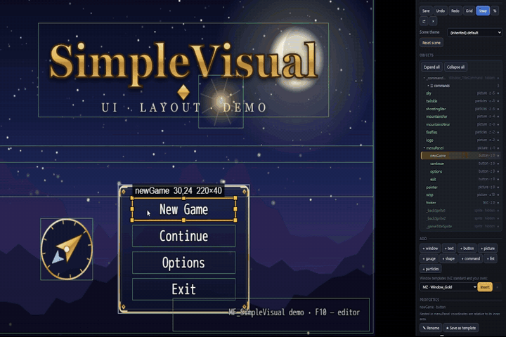
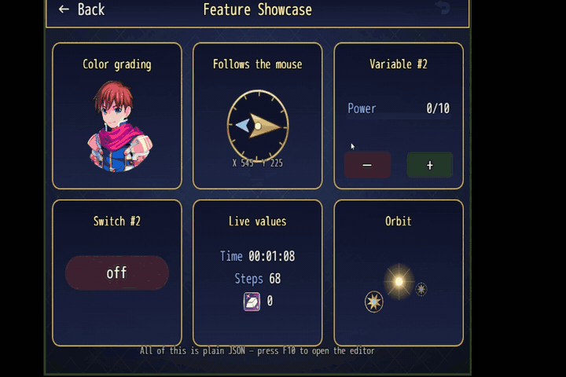
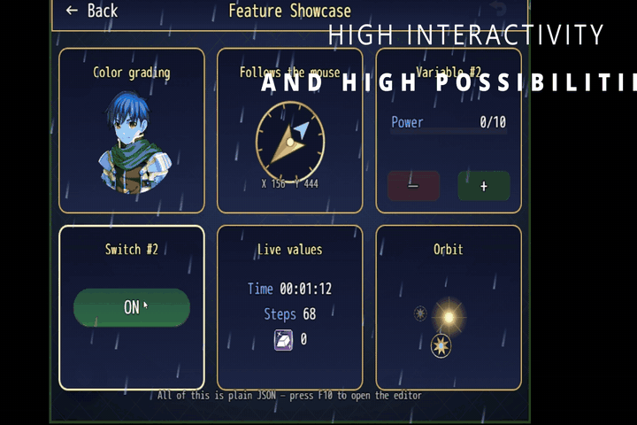
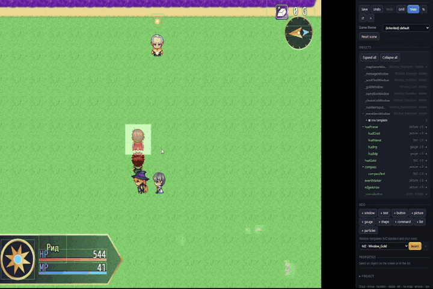

<p align="center"></p>

<p align="center"><b>Documentation for the MF plugins for RPG Maker MZ</b><br>
SimpleVisual: re-design every screen of RPG Maker MZ, visually, without code.</p>

<p align="center">
<a href="https://mesafer.github.io/mf-docs"></a>


<a href="https://mesafer.itch.io/rpgmaker-mz-mf-simplevisual-plugin"></a>
</p>

<p align="center"></p>

> [!NOTE]
> This repository contains **documentation only**. The plugins are sold on **[itch.io](https://mesafer.itch.io/rpgmaker-mz-mf-simplevisual-plugin)** and are not included here.

## Read online

| | |
|---|---|
| **[SimpleVisual — Getting started](https://mesafer.github.io/mf-docs/SimpleVisual/getting-started.html)** | Install, first layout, custom scene, HUD |
| **[SimpleVisual — Reference](https://mesafer.github.io/mf-docs/SimpleVisual/index.html)** | File format, elements, actions, script API, versioning |
| **[MF_Core — Reference](https://mesafer.github.io/mf-docs/MF_Core/index.html)** | The base library, for plugin developers |
| **[MF_Core — Getting started](https://mesafer.github.io/mf-docs/MF_Core/getting-started.html)** | Writing your own MF plugin |

## Preview

| | |
|:---:|:---:|
| <br>**Visual editor** | <br>**Custom scenes** |
| <br>**Particles** | <br>**Map HUD** |

## Changelogs

- [SimpleVisual](SimpleVisual/CHANGELOG.md)
- [MF_Core](MF_Core/CHANGELOG.md)

## Contents of this repository

```
index.html        landing page of the site
assets/           logo and divider of the landing page
MF_Core/          MF_Core reference (HTML) and changelog
SimpleVisual/     SimpleVisual reference (HTML), changelog; GIFs in assets/gifs/
```

The site is static HTML with no build step, served by GitHub Pages from the `main` branch. To read it offline, open `index.html` locally.

## Feedback

Found a mistake in the docs? Open an **issue** in this repository. For plugin bugs and support, use the [itch.io page](https://mesafer.itch.io/rpgmaker-mz-mf-simplevisual-plugin) or [Discord](https://discord.gg/UsEAskQNEn).

## License

The documentation is © 2026 MesaFer, all rights reserved. You may read it, link to it and quote short parts with a link to the source. Copying the site or republishing the documentation is not allowed. Code examples in the docs may be used in your own projects that use the MF plugins. The plugins themselves are covered by the MF Plugins License, which comes with the download on itch.io.
